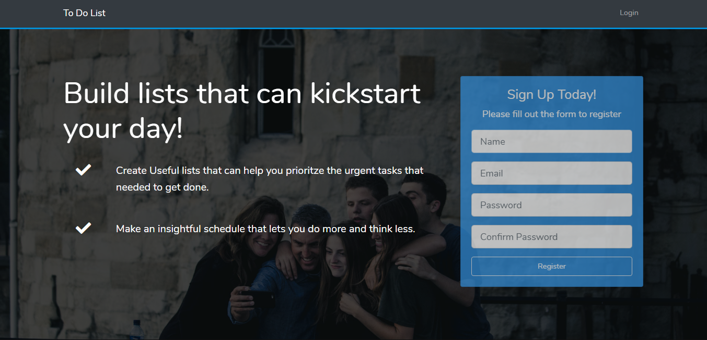
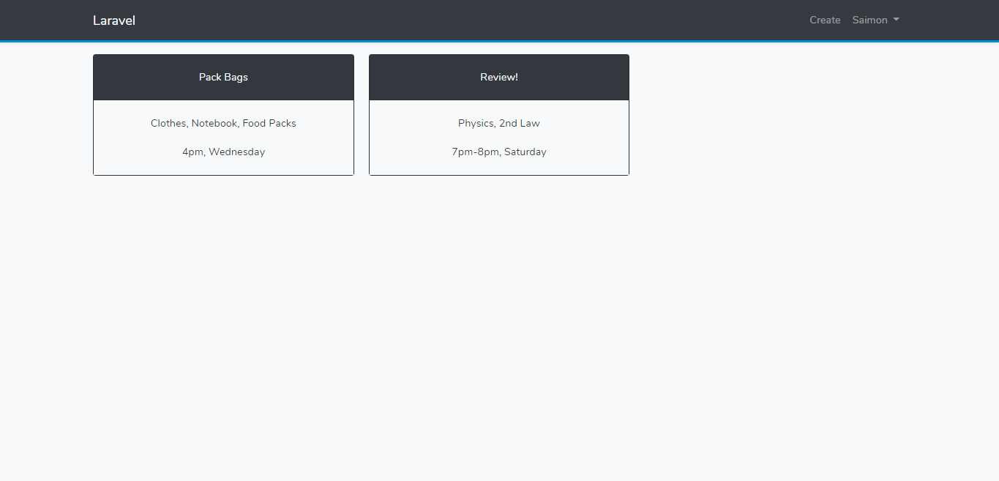
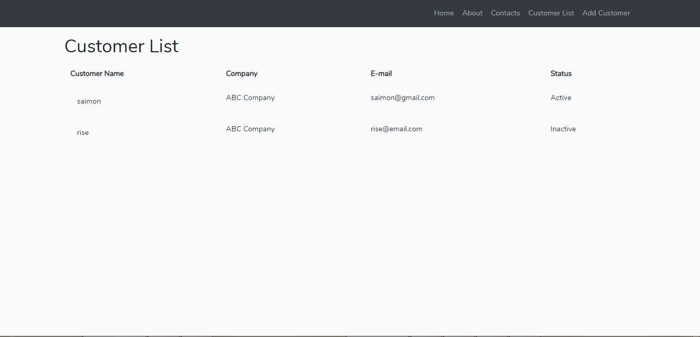
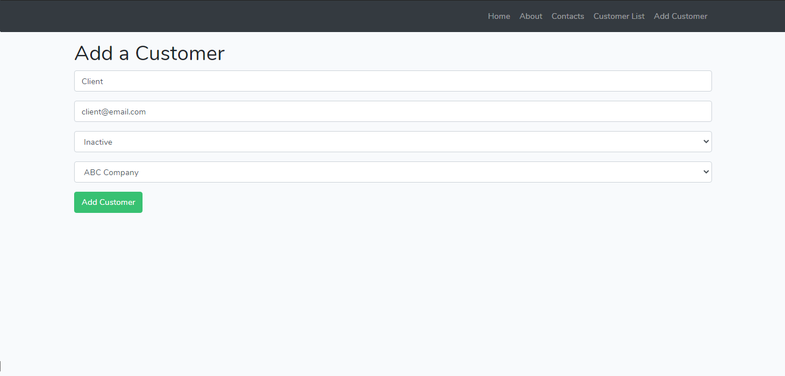
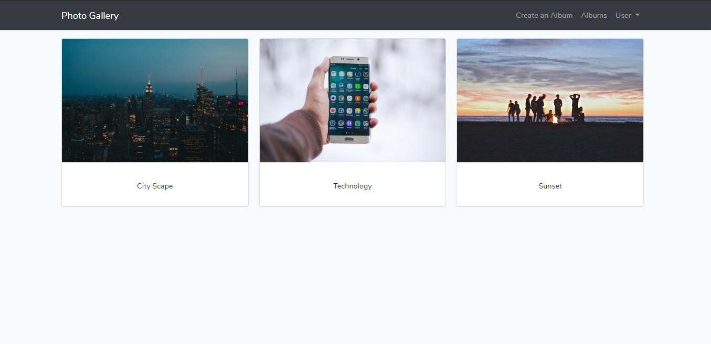
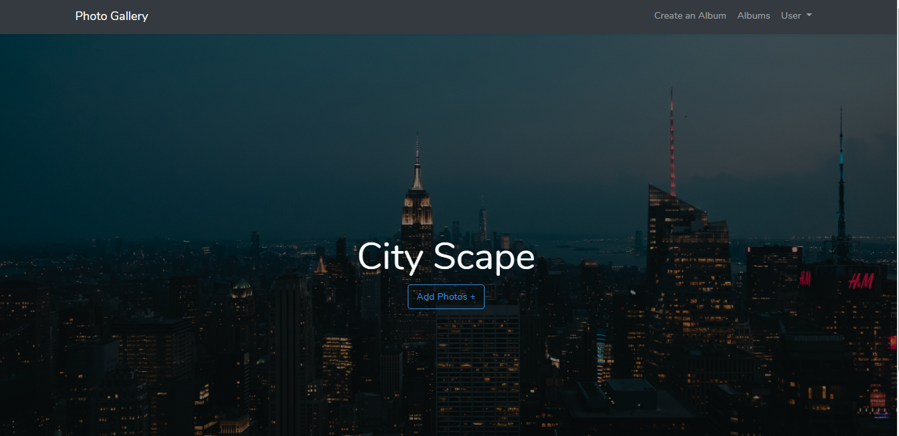

<!DOCTYPE html>
<html lang="en">

<head>
  <meta charset="UTF-8">
  <meta name="viewport" content="width=device-width, initial-scale=1.0">
  <meta http-equiv="X-UA-Compatible" content="ie=edge">
  <link rel="stylesheet" href="https://use.fontawesome.com/releases/v5.0.13/css/all.css" integrity="sha384-DNOHZ68U8hZfKXOrtjWvjxusGo9WQnrNx2sqG0tfsghAvtVlRW3tvkXWZh58N9jp"
    crossorigin="anonymous">
  <link rel="stylesheet" href="https://stackpath.bootstrapcdn.com/bootstrap/4.1.1/css/bootstrap.min.css" integrity="sha384-WskhaSGFgHYWDcbwN70/dfYBj47jz9qbsMId/iRN3ewGhXQFZCSftd1LZCfmhktB"
    crossorigin="anonymous">
  <link rel="stylesheet" href="style.css">
  <title>Portfolio</title>
</head>
<body>
<!-- Content -->

<!-- Jumbotron -->
    

        

        <!-- Navbar -->
            <nav class="navigation fixed-top">
                

                    <a href="#" class="brand">&lt;/clsn&gt;</a> 

                   
                       <ul class="nav">
                           <li class="navitem"><a href="#" class="navlink ml-5">About</a></li>
                           <li class="navitem"><a href="#" class="navlink ml-5">Contact</a></li>
                       </ul>
                   
                

            </nav>
        <!-- Jumbotron Text -->
            

                <h1 class="display-3 text-center">
                    Aspiring Web Developer
                </h1>
                
Hi, my name is Saimon.

            

        

    

    <main>
        <!-- Transition -->
        

          

            <h1 class="">Hi, I'm Saimon</h1>
          

        

        <!-- Credentials -->
       

        

          

            

                

                  <h2>About Me</h2>
                

              

               

                 I'm Saimon Robert L. Cachuela, currently, a 2nd Year Computer Engineering student at Polytechnic University of The Philippines. 
                

              

            

            
            

              

                <h2>Skills</h2>
              

            

             

              I can build simple web apps like, To do list and Photo Gallery using Laravel Framework
              

            

          

          

            

              <h2>Contacts</h2>
            
  
          

           

            
cachuelasaimon@gmail.com

            

            

          

        

          
            
          

        

       

      <!-- Projects -->
      

        

          <h1 class="">Things I've done</h1>
        

      

      

        
     

       

          
          
          
      

      

        
        
        
    

      
      
        
      
   

      

        

    </main>

 <!-- JavaScript Inlclusions -->
 
   
   

     
 
    </body> 
